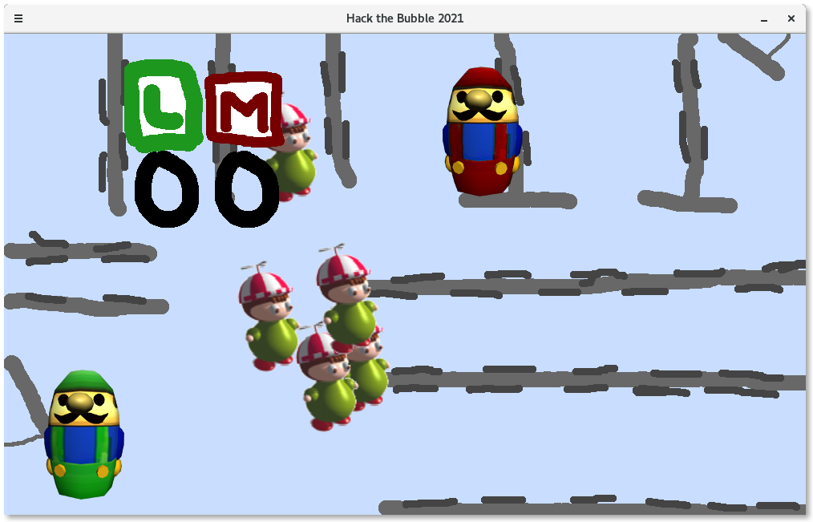
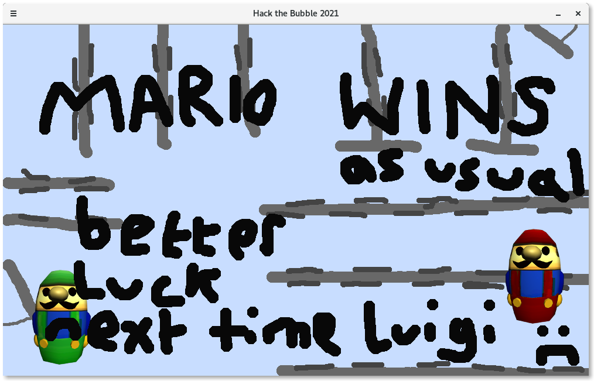

# hack-the-bubble-2021
Luigi's LABsion, a full graphical 2-player networked multiplayer game made in 9 hours solo and from scratch at Hack the Bubble 2021 using Go

Mario and Luigi are big scary final-year students in the Jack Cole building labs in St Andrews, and all of the trembling first years are scared of them! Who will scare away the most first years - Mario or Luigi?

To run the server:
cd server
./server

To run a client:
cd client
./client (character) (local IP address) (local port) (server IP address) (server port)

Example:
./client lui 138.251.29.191 22420 138.251.29.189 22068

Screenshots:

